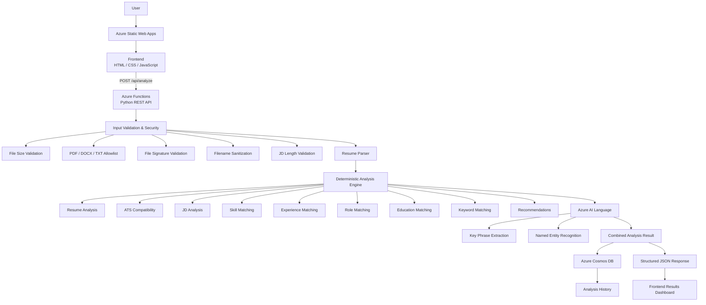
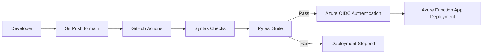
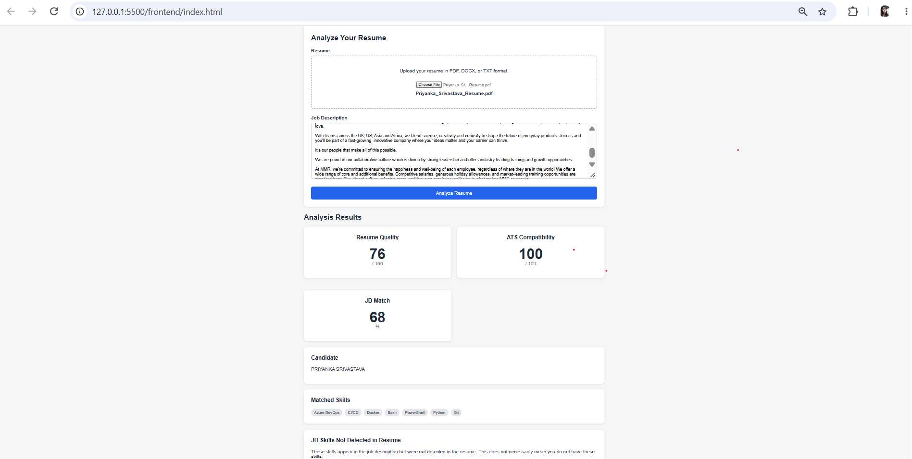
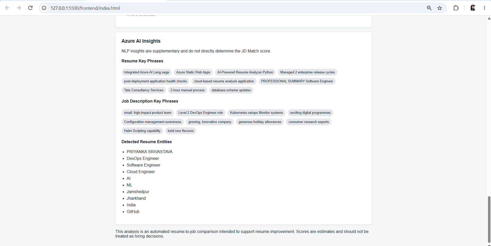
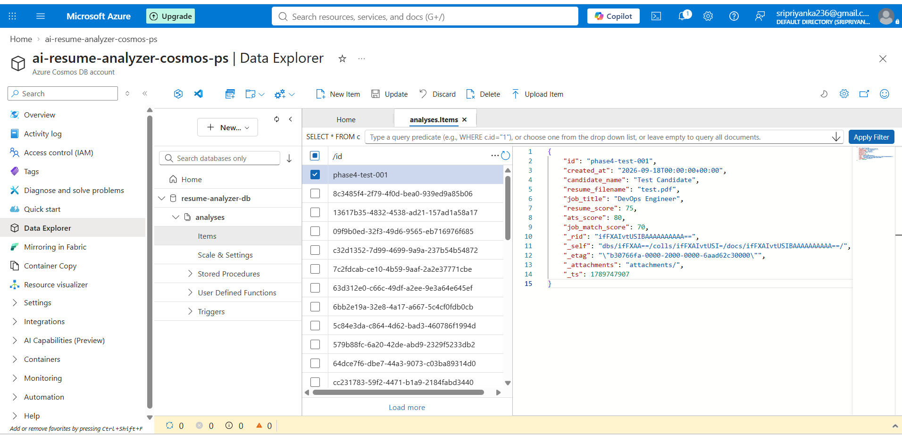
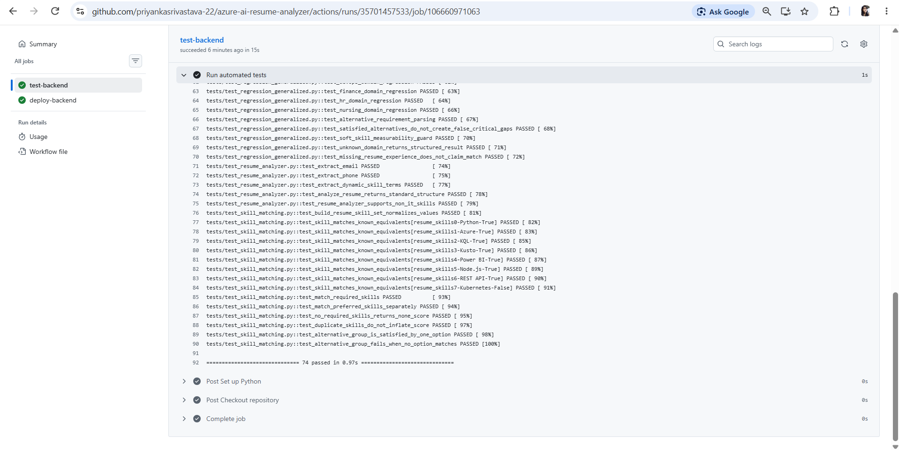
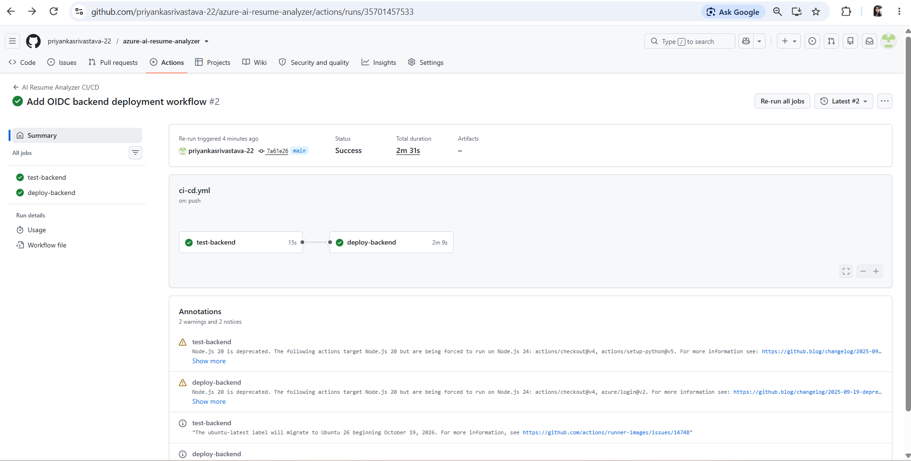
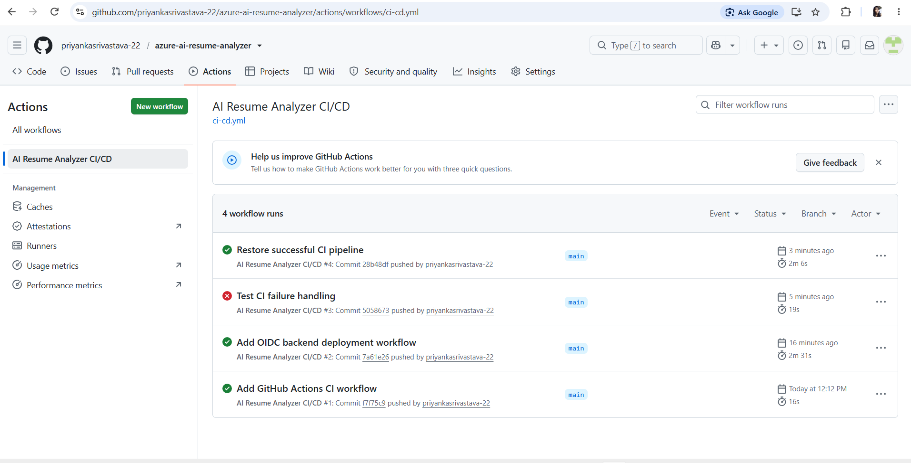

# AI Resume Analyzer

AI Resume Analyzer is a cloud-based application that evaluates a candidate's resume against a job description and returns structured, explainable analysis.

The application combines a deterministic rule-based analysis engine with Azure AI Language for NLP enrichment. The deterministic engine is responsible for resume quality, ATS compatibility, skill matching, experience matching, role alignment, education matching, keyword analysis, and recommendations, while Azure AI Language provides supplementary key phrase extraction and named entity recognition.

The project is designed to work with different resumes and job descriptions rather than being tied to one company, role, or technology domain.

## Project Overview

The application allows a user to upload a resume in PDF, DOCX, or TXT format and provide a job description.

The backend then:

1. validates and sanitizes the uploaded input;
2. extracts readable resume text and logical sections;
3. analyzes resume structure and quality;
4. evaluates ATS compatibility;
5. analyzes the job description;
6. identifies matched and not-detected skills;
7. compares candidate experience with job requirements;
8. evaluates role, education, and responsibility alignment;
9. generates resume and job-specific recommendations;
10. enriches the result with Azure AI Language;
11. stores selected analysis results in Azure Cosmos DB; and
12. returns a structured JSON response to the frontend.

The frontend presents the result as a dashboard containing resume quality, ATS compatibility, JD match, matched skills, JD skills not detected in the resume, experience alignment, recommendations, and Azure AI insights.

### Design Goals

The project was built around four main design goals:

- **Explainability** — scoring is based on deterministic rules instead of opaque AI-generated decisions.
- **Generality** — the analyzer is designed for different job roles and resume domains.
- **Cloud Integration** — Azure Functions, Azure AI Language, Azure Cosmos DB, and Azure Static Web Apps are integrated into one application.
- **Production Readiness** — the project includes automated tests, input validation, security hardening, CI/CD, error handling, and cloud deployment.

### Try the Project

Open the live application:

https://lively-wave-01395470f.6.azurestaticapps.net


## Features

The application covers the complete flow from resume upload to job-description matching and result storage.

### Resume Analysis

- Supports PDF, DOCX, and TXT resumes.
- Extracts readable resume text and standard sections.
- Detects candidate information such as name, email, and phone number where available.
- Identifies skills mentioned in the resume.
- Reviews resume structure and completeness.
- Generates a resume quality score with a detailed breakdown.
- Provides practical resume improvement suggestions.

### ATS Compatibility

- Checks whether important resume sections are present.
- Reviews contact information, bullet structure, text length, and extracted content quality.
- Produces an ATS compatibility score from deterministic rules.
- Keeps ATS compatibility separate from job-description matching.

### Job Description Analysis

- Reads the supplied job description and extracts useful requirements.
- Identifies required and preferred skills.
- Detects experience requirements.
- Detects education requirements where available.
- Extracts role and responsibility information from the job description.
- Handles alternative requirements where one of several options may satisfy the job requirement.

### Resume-to-Job Matching

- Compares resume skills with job-description requirements.
- Shows skills detected in both the resume and job description.
- Shows job-description skills that were not detected in the resume.
- Compares candidate experience with the required experience.
- Reviews role alignment.
- Reviews education alignment.
- Measures responsibility and keyword overlap.
- Produces an overall JD match score with supporting details.

### Recommendations

- Generates general resume improvement suggestions.
- Provides job-specific recommendations based on the supplied job description.
- Avoids claiming that a candidate does not have a skill simply because it was not found in the resume.
- Keeps recommendations tied to evidence found in the resume and job description.

### Azure AI Language Integration

- Uses Azure AI Language as an enrichment layer.
- Extracts key phrases from resume and job-description text.
- Detects named entities.
- Keeps Azure AI output separate from the main deterministic scoring logic.
- Allows the core analysis to continue even if the Azure AI service is temporarily unavailable.

### Analysis History

- Stores selected analysis results in Azure Cosmos DB.
- Saves the generated analysis ID for each stored result.
- Stores scores, matched skills, not-detected skills, recommendations, and other structured analysis data.
- Does not store raw resume file bytes.
- Keeps storage separate from the core analysis logic.

### API

- Provides a health-check endpoint.
- Provides a resume-analysis endpoint.
- Accepts multipart form data from the frontend.
- Supports JSON requests for local testing.
- Returns structured JSON responses.
- Uses consistent validation and internal-error response formats.

### Security and Input Validation

- Limits resume uploads to 5 MB.
- Allows only PDF, DOCX, and TXT resume formats.
- Checks basic file signatures instead of trusting only the file extension.
- Validates TXT files as UTF-8 text.
- Sanitizes uploaded filenames.
- Removes client-supplied directory paths from filenames.
- Removes null bytes from filenames.
- Requires job descriptions to contain at least 100 characters.
- Limits job descriptions to 50,000 characters.
- Keeps detailed internal exceptions in server logs instead of exposing them to the client.

### Automated Testing

- Includes unit tests for the main analyzer modules.
- Tests skill matching and experience matching.
- Tests API behavior.
- Tests Azure AI integration using mocks instead of live cloud calls.
- Includes regression tests for generalized resume and job-description matching.
- Includes dedicated security-validation tests.
- Final local test suite: **95 passing tests**.

### CI/CD

- Uses GitHub Actions for automated testing and backend deployment.
- Runs syntax checks before deployment.
- Runs the full Pytest suite on repository changes.
- Stops deployment if tests fail.
- Uses Azure OpenID Connect authentication for deployment.
- Avoids storing a long-lived Azure client secret in GitHub.
- Automatically deploys the Azure Functions backend after successful validation.

### Cloud Deployment

- Frontend hosted on Azure Static Web Apps.
- Backend hosted on Azure Functions.
- NLP enrichment provided by Azure AI Language.
- Analysis history stored in Azure Cosmos DB.
- CORS configured so the deployed frontend can call the backend API.

## Technology Stack

The project uses a small set of technologies across the frontend, backend, cloud services, storage, testing, and deployment pipeline.

| Area | Technology | Purpose |
|---|---|---|
| Frontend | HTML, CSS, JavaScript | Builds the user interface and sends resume/JD requests to the backend |
| Backend | Python | Main backend language |
| API | Azure Functions | Hosts the serverless REST API |
| Resume Processing | Python parsing logic | Extracts text and sections from uploaded resumes |
| Analysis Engine | Deterministic Python rules | Handles resume quality, ATS compatibility, JD matching, skills, experience, role, education, keywords, and recommendations |
| NLP | Azure AI Language | Extracts key phrases and named entities |
| Database | Azure Cosmos DB for NoSQL | Stores selected analysis results and analysis history |
| Frontend Hosting | Azure Static Web Apps | Hosts the production frontend |
| Backend Hosting | Azure Functions Flex Consumption | Hosts the production API |
| Testing | Pytest | Runs unit, API, regression, and security tests |
| CI/CD | GitHub Actions | Runs automated tests and deploys the backend |
| Azure Authentication | OpenID Connect (OIDC) | Allows GitHub Actions to authenticate to Azure without a long-lived client secret |
| Version Control | Git and GitHub | Source control and repository hosting |
| Local Configuration | `.env` | Stores local environment variables outside source control |

### Main Backend Packages

The backend uses the following main Python packages:

- `azure-functions` — Azure Functions runtime integration.
- `azure-ai-textanalytics` — Python SDK used to communicate with Azure AI Language.
- `azure-cosmos` — Python SDK used to read and write analysis data in Cosmos DB.
- `python-dotenv` — Loads local environment variables during development.
- `pytest` — Runs the automated test suite.

### Runtime

- Python 3.10
- Azure Functions
- Azure Functions Core Tools for local development
- PowerShell commands are used throughout the local setup and deployment steps

### Application Flow

```text
Resume + Job Description
        ↓
Input Validation
        ↓
Resume Parsing
        ↓
Deterministic Analysis
        ↓
Azure AI Language Enrichment
        ↓
Resume/JD Match Result
        ↓
Cosmos DB Persistence
        ↓
Frontend Results Dashboard
```

## Local Setup

The application can be run locally before deploying it to Azure.

The steps below use Windows PowerShell, but the same project can be run on Linux or macOS with equivalent shell commands.

### Prerequisites

Install the following before starting:

- Python 3.10
- Git
- Azure Functions Core Tools v4
- Node.js and npm only if you want to use the Azure Static Web Apps CLI
- An Azure account only if you want to test Azure AI Language and Cosmos DB locally

Verify the main tools:

```powershell
python --version
git --version
func --version
```

Expected Python version:

```text
Python 3.10.x
```

---

### 1. Clone the Repository

```powershell
git clone https://github.com/<YOUR_GITHUB_USERNAME>/azure-ai-resume-analyzer.git
```

Move into the project:

```powershell
cd azure-ai-resume-analyzer
```

Check the repository:

```powershell
git status
```

---

### 2. Create a Python Virtual Environment

From the repository root:

```powershell
python -m venv .venv
```

Activate it:

```powershell
.\.venv\Scripts\Activate.ps1
```

After activation, the terminal should show something similar to:

```text
(.venv) PS ...\azure-ai-resume-analyzer>
```

Verify which Python installation is active:

```powershell
python --version
```

---

### 3. Install Backend Dependencies

Move into the backend directory:

```powershell
cd backend
```

Upgrade pip:

```powershell
python -m pip install --upgrade pip
```

Install application dependencies:

```powershell
python -m pip install -r requirements.txt
```

Install development and testing dependencies:

```powershell
python -m pip install -r requirements-dev.txt
```

Verify the installation:

```powershell
python -m pip list
```

Return to the repository root if needed:

```powershell
cd ..
```

---

### 4. Configure Local Environment Variables

Create a `.env` file in the repository root:

```powershell
New-Item .env -ItemType File
```

Open it:

```powershell
code .env
```

Use the following structure:

```env
AZURE_LANGUAGE_ENDPOINT=<YOUR_AZURE_LANGUAGE_ENDPOINT>
AZURE_LANGUAGE_KEY=<YOUR_AZURE_LANGUAGE_KEY>

COSMOS_ENDPOINT=<YOUR_COSMOS_ENDPOINT>
COSMOS_KEY=<YOUR_COSMOS_KEY>
COSMOS_DATABASE=resume-analyzer-db
COSMOS_CONTAINER=analyses
```

Do not place real credentials in `README.md`, source code, screenshots, or committed files.

The repository `.gitignore` excludes:

```text
.env
.env.*
local.settings.json
```

Verify that `.env` is ignored:

```powershell
git check-ignore -v .env
```

Do not use commands such as:

```powershell
Get-Content .env
```

when recording screenshots or terminal output for public documentation because this can display credentials.

---

### 5. Azure AI Language Configuration

Azure AI Language is used for:

- key phrase extraction;
- named entity recognition.

The main analyzer does not depend on Azure AI Language for deterministic resume-to-job scoring.

If Azure AI Language credentials are not configured or the service is temporarily unavailable, the application is designed to continue running the core analysis while marking the Azure NLP result as unavailable.

To verify that the local variables are loaded without printing their values:

```powershell
python -c "from dotenv import load_dotenv; import os; load_dotenv(); print('Endpoint loaded:', bool(os.getenv('AZURE_LANGUAGE_ENDPOINT'))); print('Key loaded:', bool(os.getenv('AZURE_LANGUAGE_KEY')))"
```

Expected:

```text
Endpoint loaded: True
Key loaded: True
```

---

### 6. Cosmos DB Configuration

Cosmos DB is used to store selected analysis history.

The local `.env` should contain:

```env
COSMOS_ENDPOINT=<YOUR_COSMOS_ENDPOINT>
COSMOS_KEY=<YOUR_COSMOS_KEY>
COSMOS_DATABASE=resume-analyzer-db
COSMOS_CONTAINER=analyses
```

The project does not store the raw uploaded PDF or DOCX file in Cosmos DB.

If the required database and container have not yet been created, the project includes:

```text
backend/setup_cosmos.py
```

Run it from the repository root:

```powershell
python backend/setup_cosmos.py
```

Expected output should confirm:

```text
Cosmos DB setup successful.
Database: resume-analyzer-db
Container: analyses
Partition key: /id
```

Do not print the Cosmos key during verification.

---

### 7. Start the Backend Locally

Azure Functions must be started from the `backend` directory because that directory contains the Function App files.

Move into the backend:

```powershell
cd backend
```

Start Azure Functions:

```powershell
func start
```

If required:

```powershell
func start --python
```

The local API should expose:

```text
GET  http://localhost:7071/api/health
POST http://localhost:7071/api/analyze
```

Keep this terminal running while using the application.

---

### 8. Verify the Health Endpoint

Open a second PowerShell terminal and run:

```powershell
Invoke-RestMethod "http://localhost:7071/api/health"
```

Expected response:

```text
success : True
service : AI Resume Analyzer
status  : healthy
```

This confirms that the local Azure Functions backend is running.

---

### 9. Run the Automated Tests

From the `backend` directory:

```powershell
python -m pytest tests -q
```

The current completed security-hardened project has:

```text
95 passed
```

For detailed test output:

```powershell
python -m pytest tests -v
```

Run Python syntax validation:

```powershell
python -m py_compile function_app.py
```

Validate all analyzer modules:

```powershell
Get-ChildItem analyzer\*.py | ForEach-Object {
    python -m py_compile $_.FullName
}
```

No output from `py_compile` means no Python syntax error was detected.

---

### 10. Start the Frontend Locally

Open another PowerShell terminal.

From the repository root:

```powershell
cd frontend
```

A simple local HTTP server can be started with Python:

```powershell
python -m http.server 5500
```

Open:

```text
http://localhost:5500
```

Keep this terminal running while testing the frontend.

---

### 11. Connect the Local Frontend to the Local API

For local development, the frontend request must target:

```text
http://localhost:7071/api/analyze
```

The request in `frontend/script.js` should conceptually use:

```javascript
const response = await fetch(
    "http://localhost:7071/api/analyze",
    {
        method: "POST",
        body: formData,
    }
);
```

The browser automatically creates the correct multipart boundary when `FormData` is used.

Do not manually set:

```text
Content-Type: multipart/form-data
```

for this request.

If `frontend/script.js` currently contains the deployed Azure Function URL, switch it to the localhost API while performing local testing and ensure the intended production URL is used again before production deployment.

---

### 12. Test the Application

With both services running:

```text
Frontend:
http://localhost:5500

Backend:
http://localhost:7071
```

Use the frontend to:

1. select a PDF, DOCX, or TXT resume;
2. paste a complete job description;
3. submit the analysis;
4. wait for the backend response;
5. verify the displayed results.

The result dashboard should display information such as:

```text
Resume Quality
ATS Compatibility
JD Match
Candidate Information
Resume Skills
Matched Skills
JD Skills Not Detected in Resume
Experience Match
Role Match
Keyword Match
Education Match
Recommendations
Azure AI Key Phrases
Azure AI Entities
```

---

### 13. Upload Validation Rules

The backend currently applies the following request limits:

```text
Maximum resume size:       5 MB
Allowed resume formats:    PDF, DOCX, TXT
Minimum JD length:         100 characters
Maximum JD length:         50,000 characters
```

The backend also performs:

- filename sanitization;
- client path removal;
- null-byte removal;
- file-extension validation;
- basic PDF signature validation;
- basic DOCX signature validation;
- UTF-8 validation for TXT files.

These checks are performed on the backend even if similar checks exist in the browser.

---

### 14. Local Testing Without Azure Services

The core analyzer is deterministic and is designed so that supplementary cloud-service failures do not stop the main analysis.

If Azure AI Language is unavailable:

```text
Core analysis → continues
Azure NLP result → marked unavailable
```

If Cosmos DB persistence fails:

```text
Core analysis → continues
Analysis storage → skipped
analysis_id → may be null
```

This allows local development and debugging of the main analyzer without making every test depend on a live Azure service.

Automated tests use mocks for cloud integrations where appropriate so the test suite remains repeatable and does not require live Azure calls.

---

### 15. Stop the Local Services

To stop the backend or frontend development server, return to the relevant terminal and press:

```text
Ctrl + C
```

Deactivate the Python virtual environment when finished:

```powershell
deactivate
```

---

### Local Development Flow

```text
Clone repository
        ↓
Create .venv
        ↓
Install dependencies
        ↓
Configure local environment variables
        ↓
Start Azure Functions backend
        ↓
Verify /api/health
        ↓
Run frontend locally
        ↓
Upload Resume + Job Description
        ↓
Review Analysis
        ↓
Run Pytest before committing changes
```

### Before Committing Changes

Run:

```powershell
cd backend
python -m pytest tests -q
python -m py_compile function_app.py
cd ..
git diff --check
git status
```

Confirm that:

```text
All tests pass
No syntax errors are reported
No whitespace errors are reported
.env is not staged
local.settings.json is not staged
No credentials are present in source files
Only intended files are included in the commit
```

## Architecture

The AI Resume Analyzer uses a cloud-based architecture where the frontend is hosted on Azure Static Web Apps and communicates with a Python Azure Functions backend through a REST API.



### Architecture Flow

1. The user uploads a resume and provides a job description through the web interface.
2. The frontend sends the request to the Azure Functions REST API.
3. The backend validates file size, format, file signature, filename, and job-description length.
4. The resume parser extracts readable text and logical resume sections.
5. The deterministic analysis engine evaluates resume quality, ATS compatibility, skills, experience, education, role alignment, and job-description matching.
6. Azure AI Language enriches the analysis using key phrase extraction and named entity recognition.
7. The deterministic and Azure AI results are combined into a structured analysis response.
8. Selected analysis results are persisted in Azure Cosmos DB.
9. The API returns structured JSON to the frontend.
10. The frontend displays the scores, matched skills, JD skills not detected, recommendations, and Azure AI insights.

> Azure AI Language is used as an NLP enrichment layer. The application's scoring and resume-to-job matching remain deterministic so that results are explainable and repeatable.

### CI/CD Flow



The deployment pipeline runs automated validation before deployment. Azure authentication uses OpenID Connect (OIDC), avoiding the need to store a long-lived Azure client secret in GitHub.

## Azure Architecture

The application uses several Azure services, with each service handling a separate part of the system.

### Azure Static Web Apps

Azure Static Web Apps hosts the frontend of the application.

The frontend contains:

- `index.html`
- `styles.css`
- `script.js`

Its main responsibilities are:

- allowing the user to upload a resume;
- accepting the job description;
- sending the request to the backend API;
- displaying the analysis result.

The browser sends the resume and job description to the Azure Functions backend using:

```text
POST /api/analyze
```

The frontend itself does not perform the main resume scoring or job matching.

---

### Azure Functions

Azure Functions hosts the Python backend API.

The backend exposes:

```text
GET /api/health
POST /api/analyze
```

`GET /api/health` is used to confirm that the backend is running.

`POST /api/analyze` handles the complete resume-analysis request.

The Azure Function is responsible for:

- reading the uploaded resume;
- validating the request;
- checking file size and file type;
- checking basic file signatures;
- sanitizing filenames;
- validating job-description length;
- extracting resume text;
- running the deterministic analysis engine;
- calling Azure AI Language;
- saving selected results to Cosmos DB;
- returning the final structured JSON response.

The backend is deployed on Azure Functions Flex Consumption.

This keeps the API serverless, so a dedicated virtual machine or permanently running application server is not required.

---

### Deterministic Analysis Engine

The main matching logic runs inside the Azure Functions application.

This part is written in Python and handles:

- resume parsing;
- resume quality scoring;
- ATS compatibility;
- job-description analysis;
- skill matching;
- experience matching;
- role matching;
- education matching;
- responsibility and keyword matching;
- recommendations.

The deterministic engine remains responsible for the main scores.

This means the same resume and job description should produce repeatable results when the analysis rules remain unchanged.

Azure AI Language is not used to make the final matching decision.

---

### Azure AI Language

Azure AI Language provides additional NLP information for the resume and job description.

The application currently uses it for:

- key phrase extraction;
- named entity recognition.

For example, it may identify useful phrases such as:

```text
deployment automation
cloud infrastructure
incident management
software engineering
```

or entities found in the text.

Azure AI Language is used as a supporting layer rather than the main scoring engine.

The flow is:

```text
Resume / Job Description
        ↓
Deterministic Analysis
        +
Azure AI Language Enrichment
        ↓
Combined API Response
```

If Azure AI Language is temporarily unavailable, the application is designed to continue the core resume analysis.

In that situation, the Azure AI part of the response is marked unavailable instead of failing the entire request.

---

### Azure Cosmos DB

Azure Cosmos DB for NoSQL stores selected analysis results.

Each completed analysis can be stored as a JSON document.

The project uses:

```text
Database:  resume-analyzer-db
Container: analyses
Partition key: /id
```

Each analysis receives a unique ID.

Stored information can include:

- analysis ID;
- creation timestamp;
- candidate name;
- resume filename;
- detected job title;
- resume quality score;
- ATS compatibility score;
- JD match score;
- matched skills;
- JD skills not detected in the resume;
- experience matching information;
- role matching information;
- keyword matching information;
- recommendations.

The application intentionally does not store:

- raw PDF file bytes;
- raw DOCX file bytes;
- Azure AI keys;
- Cosmos DB keys;
- passwords;
- environment variables.

This keeps the stored analysis smaller and avoids saving unnecessary sensitive configuration data.

Cosmos persistence is treated as a secondary operation.

If Cosmos DB is unavailable:

```text
Resume analysis
        ↓
still succeeds

Cosmos save
        ↓
fails gracefully
```

The API can still return the analysis result even if the history record could not be stored.

---

### Azure Storage Account

The Azure Function App uses an Azure Storage account as part of the Azure Functions deployment and runtime setup.

The storage account is not used as the resume-analysis database.

Application analysis history is stored in Cosmos DB instead.

This distinction is important:

```text
Azure Storage Account
→ supports Azure Functions infrastructure/deployment

Azure Cosmos DB
→ stores application analysis records
```

---

### CORS

The production frontend and backend are hosted separately.

For example:

```text
Frontend
Azure Static Web Apps

        ↓ browser request

Backend
Azure Functions
```

Browsers apply the same-origin security model, so the Azure Function must explicitly allow requests from the deployed frontend origin.

CORS configuration is therefore added to the Function App for the trusted frontend URL.

During local development, the local frontend origin can also be allowed, for example:

```text
http://localhost:5500
```

Only required frontend origins should be allowed.

---

### Environment Variables

Cloud credentials and configuration values are not hard-coded into the Python source.

The backend reads values such as:

```text
AZURE_LANGUAGE_ENDPOINT
AZURE_LANGUAGE_KEY

COSMOS_ENDPOINT
COSMOS_KEY
COSMOS_DATABASE
COSMOS_CONTAINER
```

During local development, these values are loaded from `.env`.

In Azure, the corresponding configuration is stored in the Function App settings.

The source code reads the settings using environment variables.

Conceptually:

```python
os.getenv("AZURE_LANGUAGE_ENDPOINT")
os.getenv("AZURE_LANGUAGE_KEY")
```

The actual credential values are not stored in GitHub.

---

### GitHub Actions and Azure OIDC

Backend deployment is automated through GitHub Actions.

The CI/CD flow is:

```text
Code pushed to GitHub
        ↓
GitHub Actions runner
        ↓
Install dependencies
        ↓
Run syntax checks
        ↓
Run automated tests
        ↓
Tests pass?
   ├── No → stop
   └── Yes
        ↓
Authenticate to Azure using OIDC
        ↓
Deploy Azure Function App
```

Azure authentication uses OpenID Connect instead of a long-lived Azure client secret.

The GitHub repository stores only the identifiers required by the workflow:

```text
AZURE_CLIENT_ID
AZURE_TENANT_ID
AZURE_SUBSCRIPTION_ID
```

The workflow then requests a short-lived identity token from GitHub and exchanges it with Azure.

This avoids storing an Azure client secret in GitHub.

---

### Production Request Flow

A normal production analysis follows this path:

```text
1. User opens the Azure Static Web App
                    ↓
2. User uploads resume and pastes JD
                    ↓
3. Frontend creates FormData
                    ↓
4. POST request is sent to Azure Functions
                    ↓
5. Backend validates and sanitizes input
                    ↓
6. Resume text is extracted
                    ↓
7. Deterministic analyzer runs
                    ↓
8. Azure AI Language enriches the text
                    ↓
9. Final scores and recommendations are created
                    ↓
10. Selected analysis data is saved to Cosmos DB
                    ↓
11. Structured JSON is returned
                    ↓
12. Frontend displays the result
```

---

### Failure Handling

The services are intentionally separated so that one supporting Azure service does not necessarily stop the complete application.

#### Azure AI Language failure

```text
Azure AI unavailable
        ↓
Azure NLP section marked unavailable
        ↓
Core deterministic analysis continues
```

#### Cosmos DB failure

```text
Cosmos unavailable
        ↓
Persistence error logged
        ↓
Core analysis still returned
```

#### Invalid user input

```text
Invalid request
        ↓
HTTP 400
        ↓
VALIDATION_ERROR
```

#### Unexpected backend failure

```text
Unexpected server exception
        ↓
Detailed error written to server logs
        ↓
Client receives generic HTTP 500 response
```

This keeps internal implementation details out of the public API response.

---

### Azure Service Responsibilities

| Azure Service | Responsibility in This Project |
|---|---|
| Azure Static Web Apps | Hosts the frontend |
| Azure Functions | Hosts the Python REST API and analyzer |
| Azure AI Language | Provides key phrase and entity extraction |
| Azure Cosmos DB | Stores structured analysis history |
| Azure Storage | Supports Azure Functions runtime/deployment |
| Microsoft Entra ID / Azure OIDC | Authenticates GitHub Actions deployments |

## API Documentation

The backend is exposed through Azure Functions and provides two main endpoints:

```text
GET  /api/health
POST /api/analyze
```

The health endpoint checks whether the API is running, while the analyze endpoint processes a resume against a job description.

---

### Base URLs

#### Local Development

```text
http://localhost:7071/api
```

#### Production

```text
https://ai-resume-analyzer-api-ps.azurewebsites.net/api
```

---

## 1. Health Endpoint

### Endpoint

```http
GET /api/health
```

### Purpose

Checks whether the Azure Functions backend is running and responding.

### Local Example

```powershell
Invoke-RestMethod "http://localhost:7071/api/health"
```

### Production Example

```powershell
Invoke-RestMethod "https://ai-resume-analyzer-api-ps.azurewebsites.net/api/health"
```

### Success Response

```json
{
  "success": true,
  "service": "AI Resume Analyzer",
  "status": "healthy"
}
```

### HTTP Status

```text
200 OK
```

---

## 2. Analyze Resume Endpoint

### Endpoint

```http
POST /api/analyze
```

### Purpose

Analyzes a resume against a supplied job description and returns structured resume, ATS, job-match, recommendation, and Azure NLP results.

---

## Request Format

The frontend sends the request as:

```text
multipart/form-data
```

Required fields:

| Field | Type | Required | Description |
|---|---|---:|---|
| `file` | File | Yes | Resume file in PDF, DOCX, or TXT format |
| `job_description` | String | Yes | Complete job description used for matching |

The backend also accepts:

```text
jobDescription
```

as an alternative field name for the job description.

---

## Upload Rules

The API applies the following validation:

| Rule | Value |
|---|---|
| Allowed resume formats | PDF, DOCX, TXT |
| Maximum resume size | 5 MB |
| Minimum JD length | 100 characters |
| Maximum JD length | 50,000 characters |
| PDF validation | Basic `%PDF-` signature check |
| DOCX validation | Basic ZIP/`PK` signature check |
| TXT validation | Must decode as UTF-8 |

The backend also sanitizes uploaded filenames before processing.

---

## Multipart Request Example

PowerShell example:

```powershell
$resumePath = "C:\path\to\resume.pdf"

$jobDescription = @"
We are looking for a Software Engineer with experience in Python,
Azure, APIs, SQL, Git, testing, deployment, troubleshooting,
and software development.
"@

$form = @{
    file = Get-Item $resumePath
    job_description = $jobDescription
}

Invoke-RestMethod `
    -Uri "http://localhost:7071/api/analyze" `
    -Method POST `
    -Form $form
```

For production, replace the local URL with:

```text
https://ai-resume-analyzer-api-ps.azurewebsites.net/api/analyze
```

---

## JSON Request Format

JSON requests are also supported for local testing.

Example:

```json
{
  "filename": "resume.txt",
  "resume_text": "Software Engineer with Python, Azure, SQL and Git experience.",
  "job_description": "We are hiring a Software Engineer with Python, Azure, SQL, Git, testing, deployment and troubleshooting experience."
}
```

The JSON body must be an object.

`resume_text` and `job_description` must be strings.

---

## Success Response Structure

A successful response follows this general shape:

```json
{
  "success": true,
  "analysis_id": "generated-analysis-id",
  "candidate": {
    "name": "Candidate Name"
  },
  "analysis": {
    "resume_score": 76,
    "quality_breakdown": {},
    "skills": [],
    "experience_summary": {},
    "strengths": [],
    "recommendations": [],
    "ats": {}
  },
  "job_match": {
    "match_score": 73,
    "matched_skills": [],
    "missing_skills": [],
    "experience_match": {},
    "role_match": {},
    "keyword_match": {},
    "education_match": {},
    "recommendations": []
  },
  "azure_ai": {
    "resume": {
      "available": true,
      "key_phrases": [],
      "entities": []
    },
    "job_description": {
      "available": true,
      "key_phrases": [],
      "entities": []
    }
  }
}
```

The exact values depend on the uploaded resume and job description.

---

## Main Response Sections

### `success`

Indicates whether the request completed successfully.

```json
"success": true
```

---

### `analysis_id`

Unique ID of the stored analysis when Cosmos DB persistence succeeds.

Example:

```json
"analysis_id": "8c3485f4-2f79-4f0d-bea0-939ed9a85b06"
```

If persistence is unavailable, the analysis can still succeed and `analysis_id` may be null.

---

### `candidate`

Contains candidate information detected from the resume.

Example:

```json
{
  "name": "Candidate Name"
}
```

---

### `analysis`

Contains resume-related analysis such as:

```text
resume quality
ATS compatibility
detected skills
experience summary
strengths
general recommendations
```

---

### `job_match`

Contains resume-to-job-description matching information such as:

```text
overall JD match
matched skills
JD skills not detected in the resume
experience comparison
role alignment
keyword/responsibility match
education alignment
JD-specific recommendations
```

---

### `azure_ai`

Contains supplementary Azure AI Language results.

Example:

```json
{
  "resume": {
    "available": true,
    "key_phrases": [],
    "entities": []
  },
  "job_description": {
    "available": true,
    "key_phrases": [],
    "entities": []
  }
}
```

Azure AI Language is used as an enrichment layer and does not directly control the main deterministic scoring.

---

## Validation Error Response

Invalid user input returns:

```text
HTTP 400
```

with:

```json
{
  "success": false,
  "error": {
    "code": "VALIDATION_ERROR",
    "message": "Readable validation message"
  }
}
```

Example:

```json
{
  "success": false,
  "error": {
    "code": "VALIDATION_ERROR",
    "message": "Resume file is too large. Maximum size is 5 MB."
  }
}
```

Other examples include:

```text
Resume file is empty.
Unsupported resume file type.
Uploaded file content does not match PDF format.
Job description is required.
Job description is too short for reliable matching.
Job description is too long.
Invalid JSON request body.
```

---

## Internal Error Response

Unexpected server failures return:

```text
HTTP 500
```

with a safe generic response:

```json
{
  "success": false,
  "error": {
    "code": "INTERNAL_ERROR",
    "message": "Resume analysis failed."
  }
}
```

Detailed Python exceptions are written to server logs and are not returned to the client.

---

## Azure AI Failure Behaviour

If Azure AI Language is unavailable, the core analyzer continues.

Example:

```json
{
  "available": false,
  "key_phrases": [],
  "entities": []
}
```

The main resume and JD analysis can still complete.

---

## Cosmos DB Failure Behaviour

Cosmos DB persistence is treated as a secondary operation.

If saving the analysis fails:

```text
Core analysis → continues
API response → still returned
analysis_id → may be null
```

This prevents a storage outage from breaking the main resume-analysis request.

---

## HTTP Status Summary

| Status | Meaning |
|---|---|
| `200` | Request completed successfully |
| `400` | Invalid user input |
| `500` | Unexpected internal server error |

---

## Example Request Flow

```text
Client
  ↓
POST /api/analyze
  ↓
Request parsing
  ↓
Input validation
  ↓
Resume extraction
  ↓
Resume + JD analysis
  ↓
Azure AI enrichment
  ↓
Cosmos persistence
  ↓
Structured JSON response
```

## Screenshots

The screenshots below show the main application flow, Azure integration, persistence, automated testing, and CI/CD deployment.

### Analysis Results

The frontend displays resume quality, ATS compatibility, JD match, matched skills, skills not detected in the resume, experience alignment, and recommendations.



---

### Azure AI Language Insights

Azure AI Language adds key phrase extraction and named entity recognition to the analysis result.



---

### Cosmos DB Persistence

Completed analysis results are stored as structured documents in Azure Cosmos DB.



---

### Automated Tests in GitHub Actions

The CI pipeline installs dependencies and runs the automated backend test suite before deployment.



---

### Automated Backend Deployment

After the test job succeeds, GitHub Actions authenticates to Azure using OIDC and deploys the Azure Functions backend.



---

### Pipeline Failure and Recovery

The pipeline was also tested with an intentional failing test to confirm that deployment stops when tests fail and resumes only after the issue is fixed.




## Live Application

The deployed application is available here:

**Frontend:**
https://lively-wave-01395470f.6.azurestaticapps.net

**Backend Health Check:**
https://ai-resume-analyzer-api-ps.azurewebsites.net/api/health

The frontend is hosted on Azure Static Web Apps and communicates with the Azure Functions backend.

The live application supports:

- resume upload in PDF, DOCX, and TXT format;
- job description input;
- resume quality analysis;
- ATS compatibility;
- resume-to-job matching;
- matched skills and JD skills not detected in the resume;
- experience and role alignment;
- recommendations;
- Azure AI Language insights;
- Cosmos DB persistence for completed analyses.

## Limitations and Future Enhancements

The current version of the project is complete enough to demonstrate the full resume-analysis workflow, cloud deployment, automated testing, and CI/CD. However, there are still areas that could be improved in a larger production system.

### Current Limitations

- **Scanned PDFs are not supported through OCR.**
  The parser expects readable text inside the uploaded file. Image-only or scanned resumes may not produce usable text.

- **File validation is lightweight.**
  PDF and DOCX validation checks basic file signatures, but the application does not currently perform malware scanning or deep file inspection.

- **ATS compatibility is rule-based.**
  The score is based on the project’s own deterministic rules and should not be treated as a universal score used by every real-world Applicant Tracking System.

- **Skill detection depends on resume text.**
  If a skill is not written clearly in the resume, the analyzer may not detect it even if the candidate has that skill.

- **Job-description analysis is text-based.**
  Unclear, incomplete, or poorly structured job descriptions can reduce the quality of the matching result.

- **Cosmos DB history is stored, but there is no complete history dashboard yet.**
  Analysis records can be persisted, but the current frontend focuses on the latest analysis result.

- **Authentication is not implemented for end users.**
  The current application does not provide user accounts, login, or user-specific analysis history.

- **The frontend is intentionally simple.**
  The project focuses more on backend analysis, Azure integration, testing, security, and deployment than on advanced UI design.

### Future Enhancements

Possible improvements include:

- Add OCR support for scanned PDF resumes.
- Add stronger MIME-type and file-content validation.
- Add malware scanning for uploaded files.
- Add user authentication and authorization.
- Add a personal analysis-history page.
- Allow users to reopen previous analyses.
- Add filtering and searching for stored analysis history.
- Improve resume section detection for uncommon layouts.
- Expand generalized skill and requirement extraction.
- Improve matching for alternative and equivalent skills.
- Add configurable scoring weights.
- Add richer explanation for each score component.
- Add downloadable analysis reports.
- Add side-by-side comparison of one resume against multiple job descriptions.
- Add support for comparing multiple resumes against one job description.
- Add better monitoring, telemetry, and alerting.
- Use Azure Key Vault and Managed Identity for additional production credential management.
- Add frontend CI/CD so backend and frontend deployments are handled through the same automated release process.
- Add rate limiting and abuse protection for the public API.
- Add more security and load-testing coverage.
- Add a custom domain for the deployed application.

### Production Considerations

For a larger production deployment, additional work would be required around:

- authentication;
- authorization;
- privacy controls;
- data retention;
- rate limiting;
- file scanning;
- centralized logging;
- monitoring;
- alerting;
- backup strategy;
- cost monitoring;
- compliance requirements.

The project is intended to demonstrate the complete engineering lifecycle: implementation, testing, security hardening, Azure deployment, and CI/CD.
